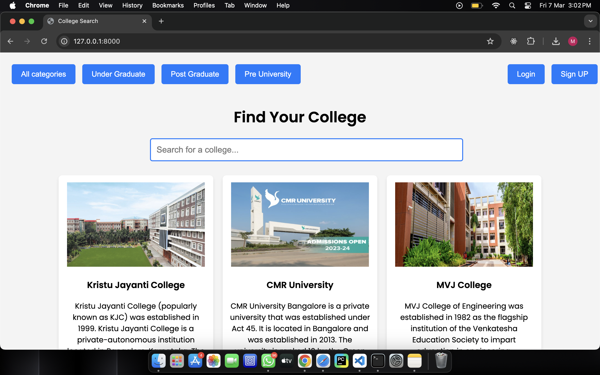
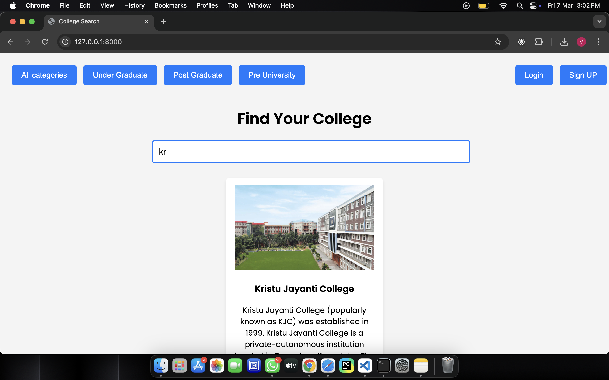
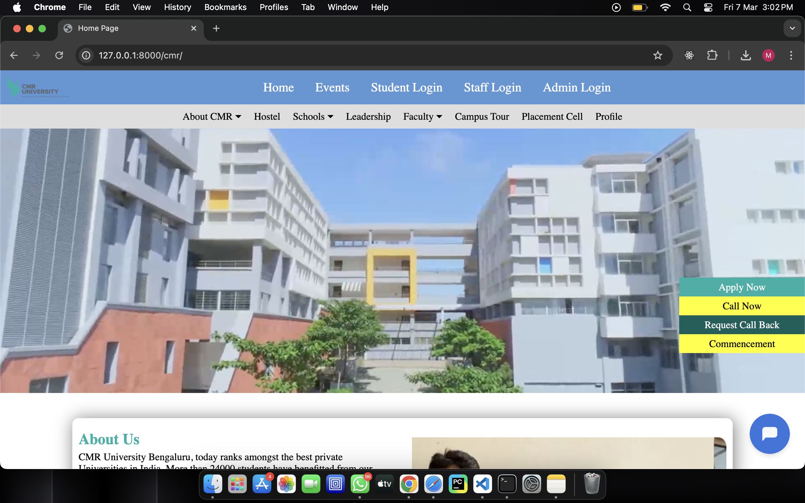
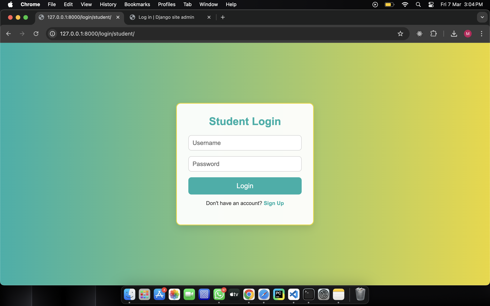
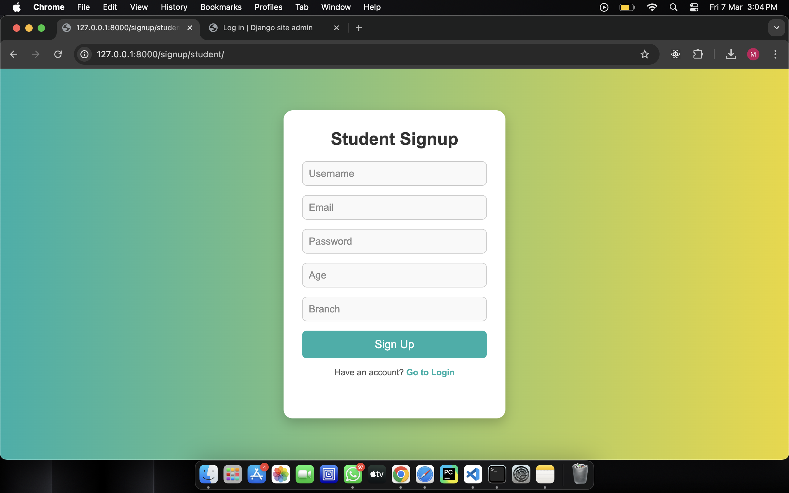
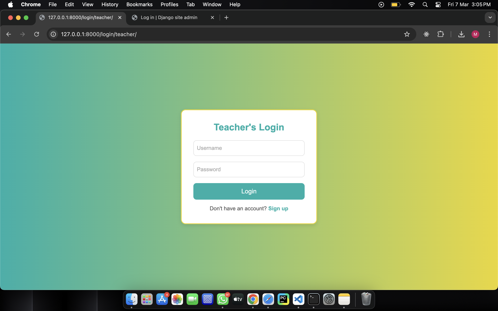
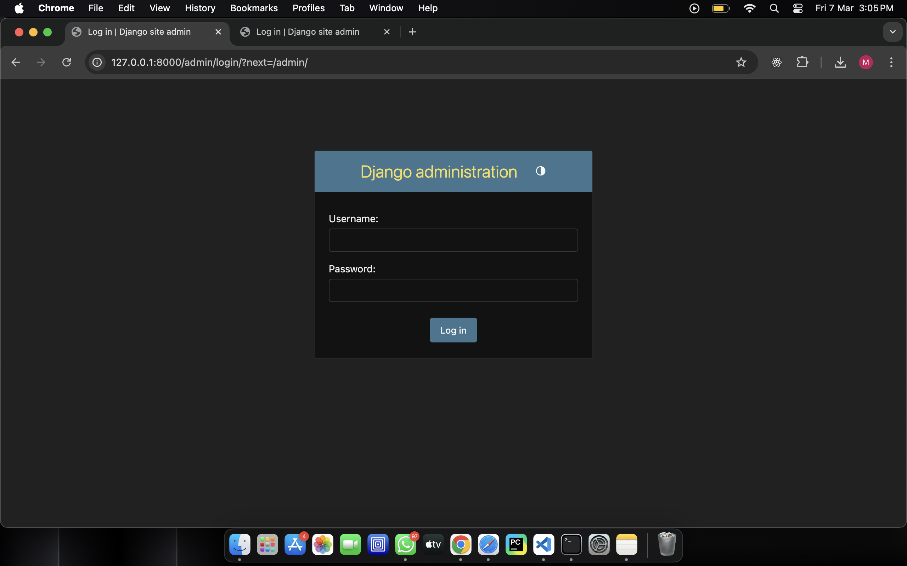
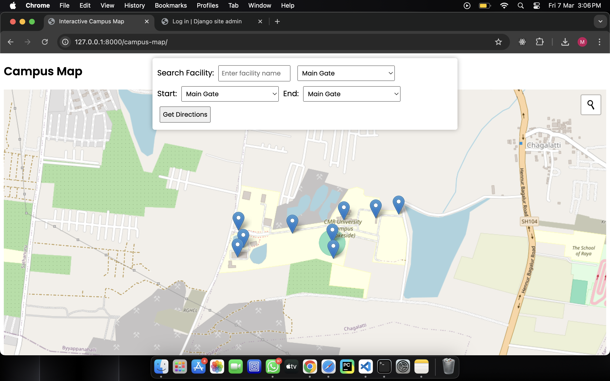
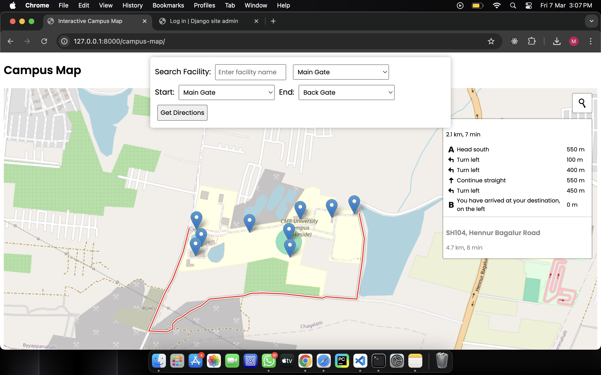
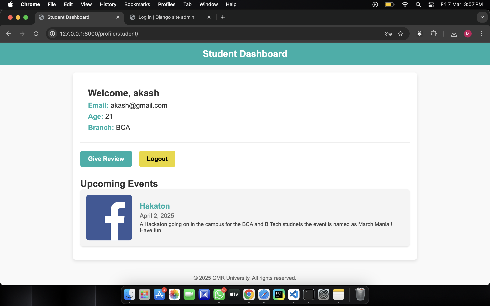

# 🎓 Campus Navigation Software

A **web-based campus navigation system** designed to enhance user experience by providing seamless navigation, event management, and facility tracking within a college campus.

## 🚀 Features

### Functional Features:
1. **User Authentication and Profiles** - Secure role-based access for students, teachers, and administrators.
2. **Interactive Campus Map** - A detailed, searchable map for easy navigation.
3. **Detailed Campus Information** - Comprehensive details about the college and its facilities.
4. **Event & Schedule Management** - View and manage upcoming campus events and schedules.
5. **Facility Locator** - Easily find important campus facilities.
6. **User Reviews & Ratings** - Share feedback on campus locations and services.
7. **Admin Dashboard** - Manage application content and user activities.

### 🔒 Non-Functional Features:
- **Ease of Use** - Designed for students and parents with intuitive navigation.
- **Security** - Protects personal data and ensures secure access.
- **Performance** - Optimized for responsiveness across various devices.
- **Usability** - Clear instructions and a user-friendly interface.
- **Multi-Platform Accessibility** - Accessible on desktops, tablets, and mobile devices.

### 🤖 Additional Features:
- **AI ChatBot** - An intelligent assistant to help with campus navigation.

## 🛠️ Tech Stack
- **Frontend**: HTML, CSS, JavaScript, Leaflet.js
- **Backend**: Django
- **Database**: SQLite3
- **Mapping**: OpenStreetMap (OSM)

## 📸 Screenshots

| Feature | Image |
|---------|-------|
| 🏠 Home Page |  |
| 🔍 Search Feature |  |
| 🎓 CMR University |  |
| 👨‍🎓 Student Login |  |
| 📝 Student Signup |  |
| 👨‍🏫 Teachers Login |  |
| 🔑 Admin Login |  |
| 🗺️ Interactive Map |  |
| 📍 Map Route |  |
| 🏅 Profile |  |

---

**📬 Contact**  
For any queries, feel free to reach out!

